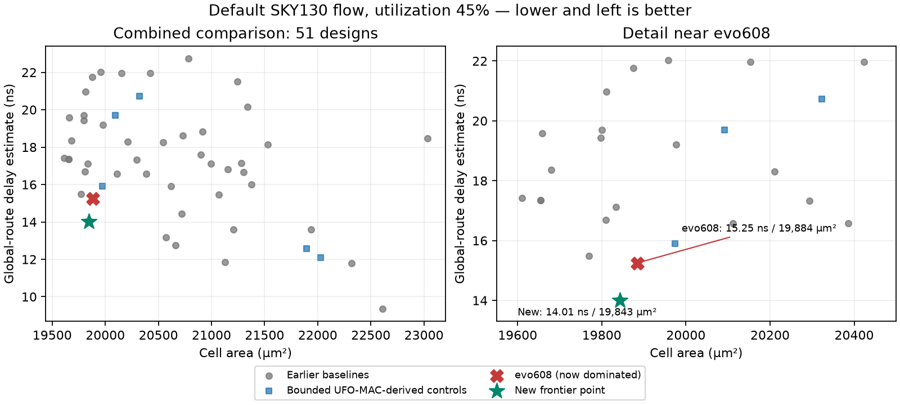

# Arithmetic Search Case Study

A completed experiment in arithmetic topology search, with verified
multiply-accumulate benchmarks and a negative result from stronger comparisons.

A frozen evolved scheduling rule (`evo608`) initially survived a finite
SKY130 area/delay frontier. A bounded prior-art compressor optimizer subsequently
produced a control that was both faster and smaller in the same default flow.
The initial frontier claim did not survive the stronger comparison.

| Default flow, estimated global-route parasitics | Delay | Cell area |
|---|---:|---:|
| Evolved candidate `evo608` | 15.25 ns | 19,884 µm² |
| Bounded UFO-MAC-derived BrentKung/mux control | 14.01 ns | 19,843 µm² |

The comparator is **8.13% faster and 0.21% smaller**. The small area difference
and a single physical-flow setting do not establish statistical robustness.
The optimizer stopped after 90 seconds with a 62.35% optimality gap. This is
ARITH-DAS's UFO-MAC compressor replication with an adapted exact-output contract,
not a reproduction of either complete method's best published performance.

Read the [short report](REPORT.md), [full comparison](results/discovery/mac_ufomac_challenge_20260905/RESULTS.md),
and [proof scope](docs/MAC_COMPOSED_PROOF.md).



## What is reusable

- The Rust arithmetic generator and a frozen external-graph importer.
- Exact unsigned 24-bit multiply / 48-bit accumulate / round / saturate / status
  benchmarks, exposing all 75 output bits.
- Independent compressor-conservation and SAT-tail correctness checks, plus
  mapped-netlist equivalence tooling.
- Frozen genomes, prior-art attribution, scripts, tool identities, and selected
  synthesis/global-route evidence including negative outcomes.

The portable benchmark contains the candidate, its exact no-rule sibling,
30 original textbook controls, and six bounded-optimizer controls. The separate
12-control arrival-aware campaign is retained in the research evidence.

## Start here

```sh
# Bundle the ready-to-use Verilog; no search, synthesis, or PDK required.
python3 scripts/package_mac24_benchmark.py /tmp/mac24-benchmark.tar.gz

# Quick integration check of the original candidate and ablation only.
# Requires Python, Icarus Verilog, and nice; runs serially.
python3 benchmarks/mac24/smoke.py
```

[REPRODUCING.md](REPRODUCING.md) separates lightweight replay from optional
physical reproduction. No experiment is launched automatically. For local builds,
use at most two Cargo jobs; run solver and physical jobs one at a time.

## Status, citation, and scope

This line of investigation is closed. This repository is an archival research
artifact, with no scheduled development, support commitment, or further compute
campaign. Reuse and independent follow-up are welcome under the licenses.

It is not a tapeout-ready chip, a fabricated-silicon result, a claim of novel
compressor scheduling, or a state-of-the-art arithmetic design. Formal correctness
of selected circuits does not establish performance superiority or novelty.

Cite Andrew Hendel and the archived version using [CITATION.cff](CITATION.cff).
The creator ORCID is [0009-0000-9877-3623](https://orcid.org/0009-0000-9877-3623),
verified against the author's existing public mojolearn citation and Zenodo record.
The DOI for this separate artifact will be added when its deposit is created. The source repository is public; the tagged GitHub release and Zenodo
archive are pending. This work has not been peer reviewed. See [RELEASE_NOTES.md](RELEASE_NOTES.md).

The public-facing project name is `arithmetic-search-case-study`. Historical
paths and the Rust package identifier `tinytapeout2-search` remain unchanged for
replay. [SOURCE_MANIFEST.json](SOURCE_MANIFEST.json) identifies the private
research source revision and every copied or adapted file; access to its full
history is not needed for the documented quick-start workflows.

Code is Apache-2.0 except the explicitly marked MIT-licensed ARITH-DAS source.
See [LICENSE](LICENSE) and [NOTICE.md](NOTICE.md). Development and analysis used
AI coding assistance; no independent human review or additional authorship is
implied.
